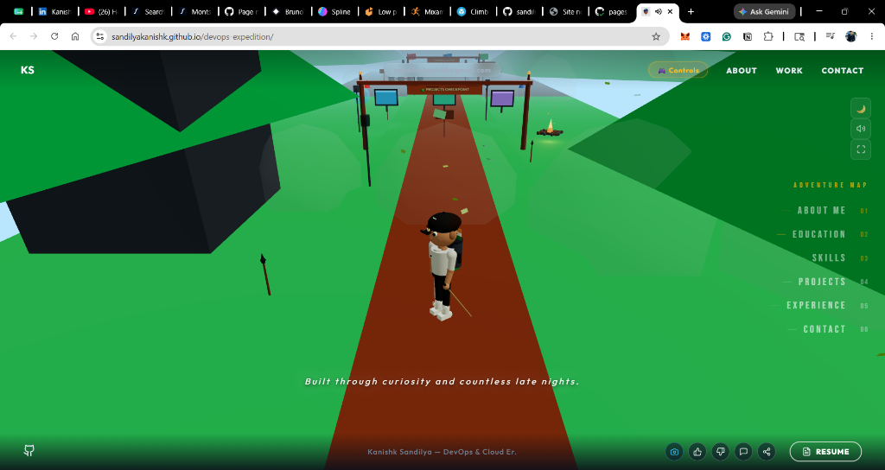
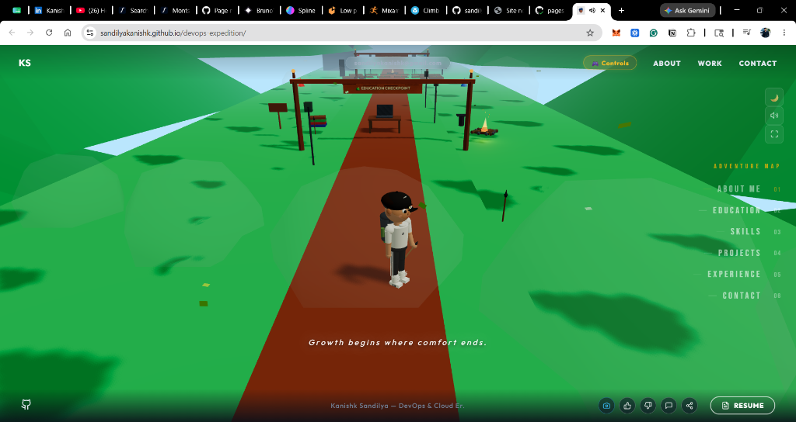

# 🏔️ DevOps Expedition: 3D Interactive Gamified Portfolio

An immersive, gamified 3D mountain trekking interactive resume showcasing DevOps engineering workflows, AWS cloud architecture, and technical capabilities. Built with modern web graphics technologies and featuring procedural assets, responsive controls, and Indian classical ambient background music.

👉 **[Live Portfolio Link](https://sandilyakanishk.github.io/devops-expedition/)**

---

## 📸 Screen Previews

| Day Mode (Normal Mode) | Night Mode (Dark Mode) |
|:---:|:---:|
|  |  |

---

## 🎮 Game Controls

### 💻 Desktop Controls
- **`W` / `A` / `S` / `D` (or Arrows)**: Move / Strafe character
- **Mouse Swipe (Click & Drag)**: Smooth camera look/orientation
- **`Shift`**: Sprint/Run
- **`Space`**: Jump
- **`Adventure Map` (Right HUD Panel)**: Instant teleportation checkpoints

### 📱 Mobile Controls
- **Virtual D-Pad (Bottom Left)**: Movement controls
- **Action Buttons (Bottom Right)**: **RUN** (Sprint toggle) and **JUMP** buttons
- **Touch Swipe**: Drag anywhere on the 3D viewport to orient the camera view

---

## ⚡ Key Highlights & Features

### 3D Trek Mechanics & Physics
- **Procedural Low-Poly Trek**: A continuous straight mountain trail, populated with trees, cabins, structures, and checkpoints.
- **Physical Boundary Collisions**: Powered by `@react-three/rapier` physics engine with capsule-colliders for character movement and cuboid terrain boundaries.
- **Fall & Respawn Protection**: Automatically detects if the character falls off the trail edge and respawns them at the nearest visited campsite/checkpoint.
- **Quick Teleportation**: Integrated sidebar HUD "Adventure Map" allowing users to teleport instantly to different checkpoints.

### High-Performance GPU Rendering (Lag Fixes)
- **Instanced Forest & Terrain**: Draws all 96 pine trees (trunk & cones), 65 boulders, trail rocks, path-edge pebbles, and snow patches using `instancedMesh` components, collapsing over 2,600 individual draw calls into under 10 draw calls.
- **Frustum Culling Stability**: Explicitly manages custom bounding volumes (`computeBoundingSphere`/`computeBoundingBox`) and disables frustum culling on instanced meshes to prevent objects from popping out of view as the camera moves.
- **Shader Starfield**: Twinkles 1,800 stars concurrently in a single WebGL draw call using a custom vertex/fragment shader.
- **Shader Fireflies & Snow**: GPU-animated particle effects on trail checkpoints, eliminating CPU processing lag.
- **Consolidated Colliders**: Collapsed separate colliders into single large static rigid bodies to minimize physics calculation overhead.

### Dynamic Audio & Day/Night Cycles
- **Interactive Soundtrack**: Procedurally plays Yaman-based Indian Classical melodies (Bansuri, Tabla, Sitar) layered with dynamic ambient noises.
- **Responsive Day/Night Ambience**: Toggle between day and night mode. Ambient effects like crickets and birds fade in/out depending on the chosen daytime setting.
- **Total Mute Control**: Instantly suspends the global AudioContext and pauses all audio elements, guaranteeing complete silence when muted.

---

## 🛠️ Technology Stack
- **Framework**: [React](https://react.dev/) + [Vite](https://vite.dev/)
- **3D Graphics Engine**: [Three.js](https://threejs.org/) + [React Three Fiber (R3F)](https://r3f.docs.pmnd.rs/)
- **3D Helpers / Utilities**: [React Three Drei](https://github.com/pmndrs/drei)
- **Physics Engine**: [React Three Rapier](https://github.com/pmndrs/react-three-rapier)
- **Animations**: [GSAP](https://gsap.com/) (GreenSock) for fluid overlay transitions
- **Icons**: [Lucide React](https://lucide.dev/)

---

## 🚀 Getting Started

### Prerequisites
- Node.js (v18 or higher)
- npm (v10 or higher)

### Local Development Installation
1. Clone the repository:
   ```bash
   git clone https://github.com/sandilyakanishk/devops-expedition.git
   cd devops-expedition
   ```
2. Install dependencies:
   ```bash
   npm install
   ```
3. Start the Vite local development server:
   ```bash
   npm run dev
   ```
4. Open the application in your browser:
   ```
   http://localhost:5173/devops-expedition/
   ```

### Building for Production
To bundle and optimize the project for production:
```bash
npm run build
```
This builds static assets into the `/dist` directory.

### Deployment to GitHub Pages
Deployment is fully automated using `gh-pages`:
```bash
npm run deploy
```
This builds the production build and pushes the distribution assets to the `gh-pages` branch, making the project instantly live.
